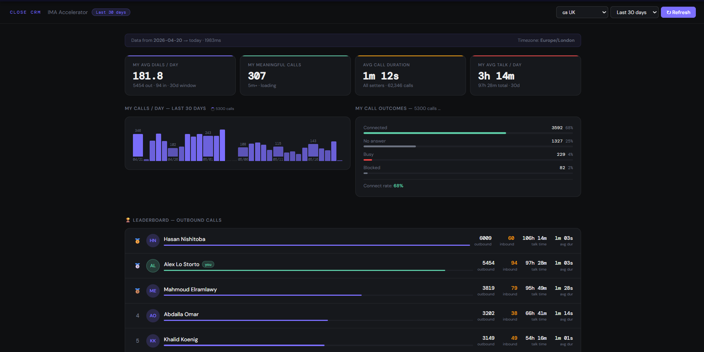

# Close CRM — Setter Dashboard

A local dashboard for Close CRM that shows your personal stats, call outcomes, meaningful calls, and a full team leaderboard — all in one dark-themed page.



---

## Features

- **Personal stats** — avg dials/day, meaningful calls (5 min+), avg call duration, avg talk time/day
- **Daily bar chart** — your calls per day for the selected period
- **Call outcomes** — connected, no-answer, voicemail, busy breakdown with connect rate
- **Team leaderboard** — ranked by outbound calls with talk time and avg duration per rep
- **Meaningful calls list** — every call over 5 minutes with a direct link to the recording
- **Timezone selector** — UK, US, Dubai, Pakistan and more
- **Period selector** — last 7, 14, 30, 60 or 90 days
- **Progressive loading** — leaderboard appears instantly, calls stream in page by page

---

## Setup

### 1. Add your API key

Open `close_proxy.py` and replace the placeholder:

```python
API_KEY = "YOUR_CLOSE_API_KEY_HERE"
```

Get your key from Close CRM → Settings → API Keys → Generate.

### 2. Install Python dependencies

No external dependencies — uses Python standard library only.

### 3. Run the proxy

```bash
python close_proxy.py
```

The dashboard opens automatically at **http://localhost:8765**

---

## How it works

| Component | What it does |
|---|---|
| `close_proxy.py` | Local HTTP server on port 8765. Handles CORS, authenticates with the Close API, and serves the dashboard HTML |
| `close_dashboard_proxy.html` | Single-file dashboard. Fetches data from the local proxy and renders everything client-side |

The proxy fetches the reporting API and activity feed in parallel using `ThreadPoolExecutor`, then streams call pages progressively so the page feels instant even with large datasets.

---

## Why a local proxy?

The Close API requires Basic auth with your API key. Browsers block cross-origin requests with credentials, so a tiny local proxy handles the auth and adds the necessary CORS headers.
